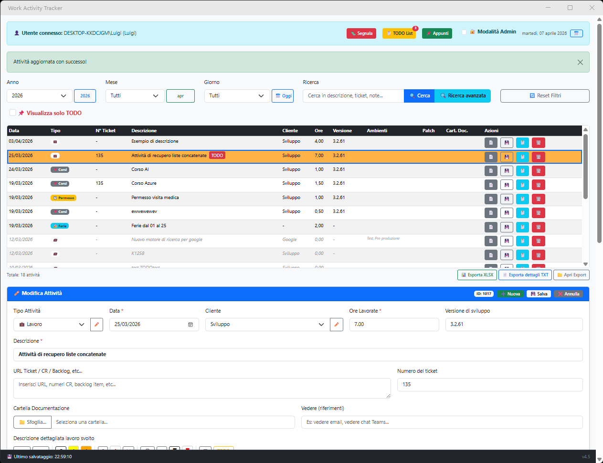
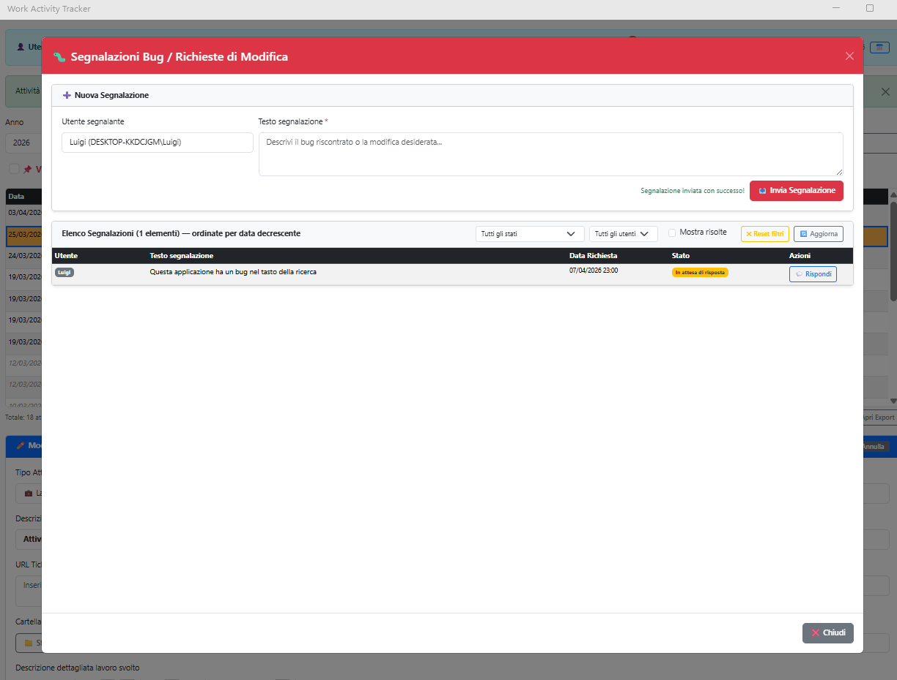
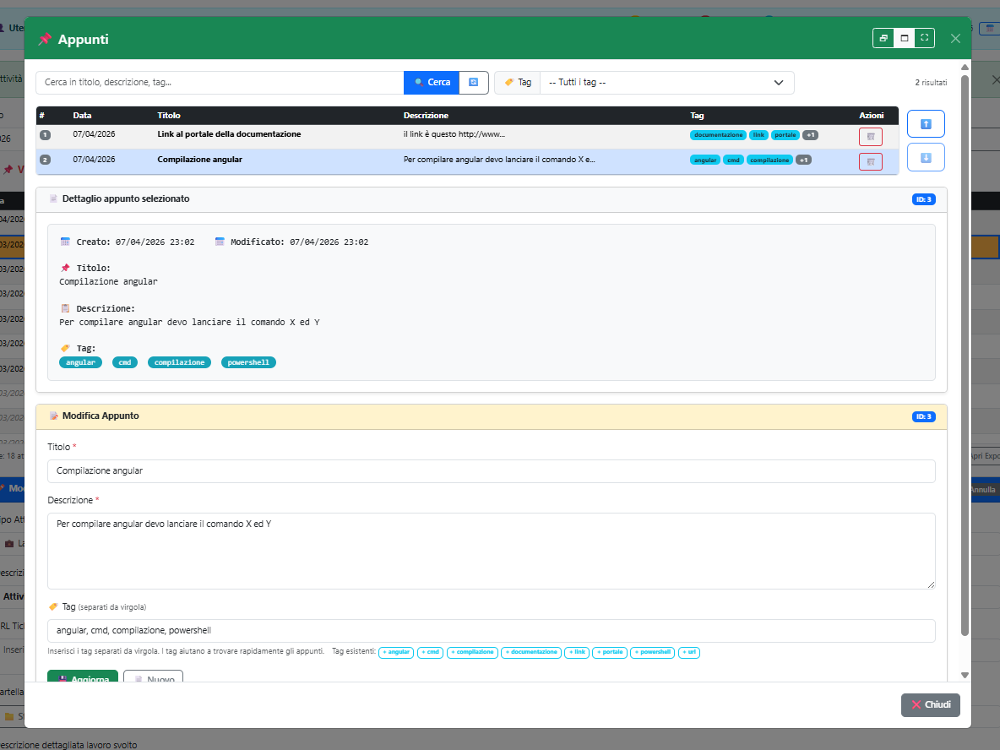
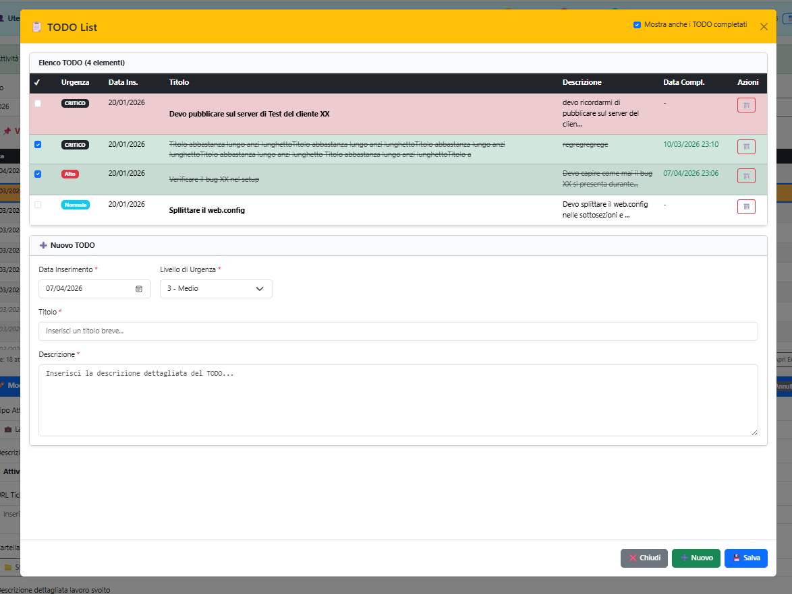
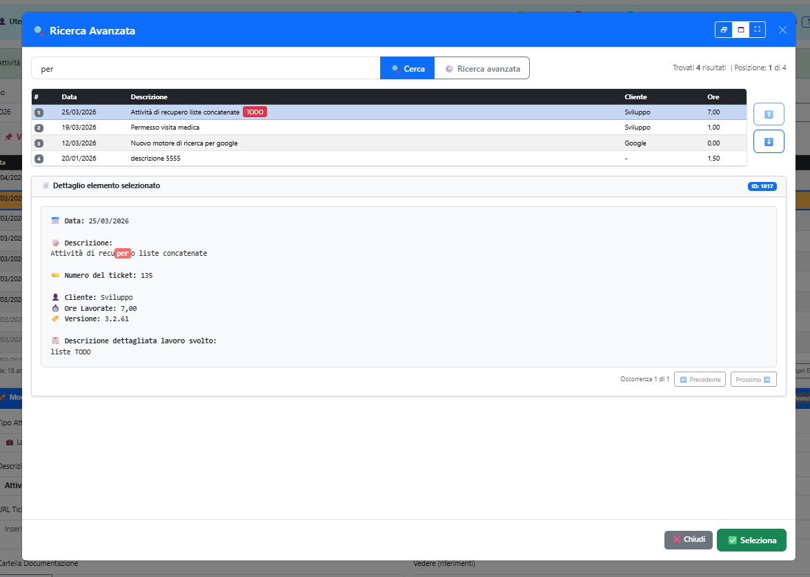

# WorkActivityTracker


A Windows desktop application for tracking daily work activities, built with **.NET MAUI Blazor Hybrid** and **SQL Server**.
Designed for software teams: log work sessions, associate them with clients and software versions, track SVN/Git changesets, and manage deployments across frozen environments (test/production).

> **WorkActivityTracker** è un'applicazione desktop Windows per il tracciamento delle attività lavorative giornaliere. Costruita con .NET MAUI Blazor Hybrid, utilizza una WebView interna per renderizzare un'interfaccia Bootstrap 5.
>
> L'applicazione permette a uno o più utenti (identificati dal login Windows) di registrare le proprie attività, associarle a clienti e versioni software, tracciare i changeset SVN/Git coinvolti e gestire il riporto delle modifiche sui congelati (ambienti di test/collaudo/produzione).

---

## Screenshot

### Interfaccia principale
Griglia delle attività con filtri per anno/mese/giorno e form di inserimento/modifica con editor Note, Changeset, congelati e barra di stato in fondo.



---

### Segnalazioni Bug / Richieste di Modifica
Modale per inviare segnalazioni agli altri utenti, con griglia riepilogativa, filtri per stato e utente, e funzionalità di risposta.



---

### Appunti / Knowledge Base
Modale per gestire una base di conoscenza personale: lista appunti con tag, editor ricco con toolbar di formattazione e filtro per tag.



---

### TODO List
Modale per la gestione dei TODO: griglia con stato, priorità e scadenza, form per aggiungere nuovi elementi e integrazione con il rilevamento TODO nelle attività.



---

### Ricerca Avanzata
Modale di ricerca full-text su tutti i campi delle attività, con anteprima del dettaglio e possibilità di selezionare direttamente l'attività trovata.



---

## Panoramica

---

## Setup e Requisiti

### Requisiti di sistema

- **Visual Studio 2022** (17.8+) con workload:
  - Sviluppo .NET Multi-platform App UI (.NET MAUI)
  - Sviluppo ASP.NET e Web
- **.NET 10 SDK** con workload MAUI: `dotnet workload install maui`
- **SQL Server** (Express, Developer o Standard)

### Setup Database

1. Esegui `Database/CreateDatabase.sql` in SSMS per creare il database iniziale
2. Applica in ordine tutti gli script `MigrateToVX.Y.sql` fino all'ultimo disponibile
3. Crea il file `appsettings.json` nella root del progetto (non è incluso nel repository) e configura la connection string:

```json
{
  "ConnectionStrings": {
    "DefaultConnection": "Data Source=NOME_SERVER;Initial Catalog=WorkActivityTracker;Integrated Security=True;TrustServerCertificate=True"
  },
  "AppSettings": {
    "AppName": "Work Activity Tracker",
    "Version": "4.4",
    "MostraModalitaAdmin": true,
    "PrivacyMode": false
  }
}
```

### Eseguire l'applicazione

Da Visual Studio: apri `WorkActivityTracker.csproj`, seleziona **Windows Machine**, premi F5.

---

## Funzionalità Principali

### 1. Gestione Attività Lavorative

Ogni attività registrata contiene:

| Campo | Tipo | Descrizione |
|---|---|---|
| `TipoAttivita` | string | Lavoro / Permesso / Ferie |
| `Data` | DateTime | Data dell'attività |
| `Descrizione` | string | Titolo breve obbligatorio (in **grassetto**) |
| `OreLavorate` | decimal | Ore dedicate (step 0.5) |
| `Cliente` | FK | Cliente associato |
| `Versione` | string | Versione software sviluppata (es: 3.2.61) |
| `UrlTicket` | string | URL ticket, CR, backlog (multiriga) |
| `Vedere` | string | Riferimenti esterni (email, Teams, ecc.) |
| `CartellaDocumentazione` | string | Path cartella locale con doc |
| `Note` | HTML | Descrizione dettagliata del lavoro (con grassetto) |
| `TestoCheckIn` | string | Testo del messaggio di check-in SCM (in **grassetto**) |
| `ChangesetCoinvolti` | HTML | Elenco changeset/commit coinvolti (con grassetto) |
| `NumeroTicket` | string | Numero/i del ticket (separati da virgola se più di uno) |
| `UrlPatchRilasci` | string | URL patch/pacchetto nei rilasci (NVARCHAR(MAX), può contenere più URL) |
| `AmbientiSelezionatiIds` | List\<int\> | Congelati su cui è riportata la modifica |
| `AmbientiRilascioNomi` | string? | Nomi ambienti rilascio separati da virgola (solo lettura, per griglia) |

Per i tipi **Permesso** e **Ferie**, vengono mostrati solo i campi Data, Ore, Descrizione e Note; gli altri campi vengono nascosti nell'interfaccia.

### 2. Griglia Attività

- Tabella con scroll verticale (max-height 300px) con sticky header.
- Filtri: Anno / Mese / Giorno + ricerca testuale full-text + checkbox "Solo TODO".
  - All'avvio: Anno e Mese impostati al mese corrente, Giorno = "Tutti".
  - Bottone **"📅 Oggi"** accanto al filtro Giorno: imposta automaticamente Anno/Mese/Giorno alla data odierna.
  - **Combo Giorno con nomi ed emoji**: quando Anno e Mese sono selezionati, ogni opzione mostra il numero + il giorno della settimana abbreviato in italiano (es. "1 - lun"). Vengono nascosti i giorni non validi per il mese selezionato. Emoji prefisso: 🟢 per il giorno odierno (ha la precedenza), 🟠 per sabato e domenica.
- **Rilevamento TODO preciso**: regex `(?<![a-zA-Z])TODO(?![a-zA-Z])` (word boundary, case-insensitive).
- **Evidenziazione TODO**: riga rossa se TODO è in Descrizione, Note, ChangesetCoinvolti, UrlTicket.
- **Riga selezionata**: colore giallo vivace (`#ffe066`). Se riga TODO+selezionata: arancione.
- **Riga totale ore**: footer con la somma delle ore delle attività visibili, allineata sotto la colonna **Ore**.
- **Colonna Ambienti**: mostra i nomi degli ambienti di rilascio compilati, separati da virgola (es. "Test, Produzione"), senza numero di versione. Calcolato da una query batch in `ActivityService.GetActivitiesAsync()` e salvato in `WorkActivityDto.AmbientiRilascioNomi`. Vuota se nessun ambiente è stato associato.
- **Colonna Patch**: mostra ✔ verde se il campo "URL Patch/Pacchetto nei rilasci" (`UrlPatchRilasci`) è compilato.
- **Colonna Azioni**: pulsanti Copia (📄), Esporta TXT (💾), Duplica (📋), Elimina (🗑️).
  - **📄 Copia**: genera testo plain dell'attività (HTML stripped) e lo copia negli appunti.
  - **💾 Esporta TXT**: salva il dettaglio dell'attività come file `.txt` nella cartella `Export/`.
  - **📋 Duplica**: copia tutti i campi tranne la data (incluso NumeroTicket).
  - **🗑️ Elimina**: mostra una **modale Blazor custom centrata** per la conferma.
- **Pulsanti export sotto la griglia** (visibili se ci sono attività):
  - **📊 Esporta XLSX**: esporta la griglia visualizzata in Excel (`ElencoAttivitàAl[timestamp].xlsx`).
  - **📄 Esporta dettagli TXT**: esporta tutte le attività visibili in un TXT (`DettaglioTutteLeAttività_[dal]_[al]_[timestamp].txt`).
  - **📁 Apri Export**: apre la cartella `Export/` in Esplora Risorse.
- Dopo il salvataggio, l'attività appena salvata rimane selezionata nella griglia.

### 3. Form di Inserimento/Modifica

La testata (header blu) contiene bottoni rapidi Nuova / **Salva (Ctrl+S)** / Annulla replicati in piccolo. I bottoni principali sono anche nel footer del form.

**Shortcut Ctrl+S**: salva l'attività corrente in qualsiasi momento (registrato via `registraCtrlS` JS + `[JSInvokable] SalvaViaShortcut()`).

Il campo **Cliente** ha un bottone **✏️** che apre la modale `ClientiEditorModal` per gestire la lista clienti (con log delle modifiche in `Clienti_Log`).

### 4. Ambienti di Rilascio (Form, v4.1)

Visibili nel form solo quando `TipoAttivita == Lavoro` e il cliente selezionato è diverso da "Sviluppo". Comprendono 3 coppie **(Tipo ambiente / Versione)** disposte orizzontalmente:

- **Tipo ambiente**: `<input list>` con `<datalist>` alimentato da `TipiAmbientiRilascio` (es. Test, Qualità, Pre-produzione, Produzione).
- **Versione**: `<input list>` con `<datalist>` alimentato da `VersioniRilascio` (es. 3.2.50, 4.1.10).
- I valori nuovi digitati vengono aggiunti automaticamente ai rispettivi lookup al salvataggio (`EnsureTipoExistsAsync`, `EnsureVersioneExistsAsync`).
- Dati persistiti in `AttivitaAmbientiRilascio` (con `Posizione` 1-3). Caricati in `SelezionaAttivita()` tramite `AmbientiRilascioService.GetAmbientiRilascioAsync()`.
- Il DTO `WorkActivityDto.AmbientiRilascio` contiene sempre 3 coppie `AmbienteRilascioDto` (Posizione, TipoAmbiente, Versione). Il campo `AmbientiRilascioNomi` (string?) è calcolato da `ActivityService.GetActivitiesAsync()` per la colonna della griglia.

### 5. Editor "Descrizione dettagliata lavoro svolto" (Note)

Campo `contenteditable` (non textarea) con toolbar di editing:
- **⇥ →** / **⇤ ←**: indentazione destra/sinistra delle righe selezionate.
- **G** (Grassetto): applica/rimuove bold con `document.execCommand('bold')`.
- **A** giallo / **A** arancione / **A** verde: evidenziatura del testo selezionato (hiliteColor).
- **S** barrato / **S** sottolineato: formattazione barrato e sottolineato.
- **A** rosso: colora il testo in rosso.
- **✕**: rimuove tutta la formattazione (bold, colore, highlight, sottolineato, ecc.).
- **◀** / 📋 / **▶**: Undo / Storico versioni / Redo (overlay in basso a destra dell'editor, sopra le scrollbar).
- **⊟**: rimuove le righe vuote dal contenuto dell'editor.
- **TODO**: sostituisce ogni occorrenza di "TODO" (parola isolata) con `--`, preservando tutta la formattazione HTML.
- Altezza: min 120px, max 300px con scroll verticale.
- Font: Segoe UI, `white-space: pre-wrap`.
- **Bordo rosso** se il campo contiene TODO.
- Salva/carica **HTML** (`innerHTML`) per persistere il grassetto nel database.
- La sincronizzazione avviene via `noteEditorHelper` (JS): `setContent`, `getHtml`, `getText`, `indent`, `rimuoviRigheVuote`.

### 6. Congelati (Ambienti di Rilascio)

La sezione "Modifica riportata sui congelati" mostra una tabella checkbox con:
- **Sviluppo** (riga virtuale): versione di sviluppo corrente.
- **Ambienti dal DB**: Codice, Versione, Data congelamento.

Quando si spunta un congelato: viene aggiunto automaticamente un blocco nell'editor Changeset (se non già presente):
```
NomeCongelato (Versione):
Changeset XXX: [Testo del check-in]
```

### 7. Editor "Elenco Changeset e lista files coinvolti"

`div` con `contenteditable="true"` con toolbar di editing:
- **⇥ →** / **⇤ ←**: indentazione (cursore rimane sulla stessa riga dopo l'operazione).
- **G** (Grassetto): applica/rimuove bold.
- **A** giallo / **A** arancione / **A** verde: evidenziatura del testo selezionato (hiliteColor).
- **S** barrato / **S** sottolineato: formattazione barrato e sottolineato.
- **A** rosso: colora il testo in rosso.
- **✕**: rimuove tutta la formattazione (bold, colore, highlight, sottolineato, ecc.).
- **◀** / 📋 / **▶**: Undo / Storico versioni / Redo (overlay in basso a destra dell'editor, sopra le scrollbar).
- **⊟**: rimuove le righe vuote dal contenuto dell'editor.
- **TODO**: sostituisce ogni occorrenza di "TODO" (parola isolata) con `--`, preservando tutta la formattazione HTML.
- Altezza: min 200px, max 350px, scroll verticale **e orizzontale**.
- Font monospace (Consolas), `white-space: pre`.
- Salva/carica **HTML** (`innerHTML`) per persistere il grassetto.
- Sincronizzazione via `changesetEditorHelper` (JS): `setContent`, `getHtml`, `getText`, `indent`, `rimuoviRigheVuote`.
- `AggiungiBloccoCongelato()`: usa `HtmlToPlainText()` per i confronti stringa, poi appende il nuovo blocco come HTML (`<strong>heading</strong><br>Changeset XXX: testo`) preservando la formattazione esistente.

### 8. TODO List (Modale)

Modale separata per gestire TODO personali. Ogni TODO: Titolo, Descrizione, Data inserimento, Urgenza (1-5), Completato. Badge con contatore nel pulsante in alto.

### 9. Appunti / Knowledge Base (Modale)

Modale per note rapide con sistema di tag (Titolo, Descrizione, Tag multi-valore). Badge con contatore nel pulsante in alto.

### 10. Editor Clienti (Modale)

Modale `ClientiEditorModal` aperta dal pulsante ✏️ accanto al campo Cliente:
- CRUD completo: aggiungi, modifica, disattiva cliente.
- Ogni modifica è tracciata in `Clienti_Log`: NomeUtente, AzioneSvolta (Nuovo/Modifica/Elimina), VecchioValore, NuovoValore, Timestamp.

### 11. Editor Congelati (Modale)

Modale `CongelatiEditorModal` aperta dal pulsante "✏️ Modifica lista" sotto la tabella congelati. Log in `Ambienti_Log`.

- Campi: Codice, Versione, Data Congelamento, **Data Dismissione**, Attivo.
- **📋 Esporta MD**: esporta la griglia in formato Markdown (tabella GFM) nella cartella `Export/` (`Congelati_[timestamp].md`).
- **Data Dismissione**: obbligatoria quando la checkbox "Attivo" viene deselezionata; il form mostra un errore di validazione se mancante. Mostrata come colonna nella griglia.
- Il log `Ambienti_Log` include `DataDismissione` nei campi `VecchioValore` e `NuovoValore` per tracciabilità completa.

### 12. Ricerca Avanzata (Modale)

Ricerca full-text su tutte le attività (senza filtri data) con griglia risultati, navigazione frecce, evidenziazione rossa, selezione attività nel form.

### 13. Segnalazioni (Modale)

Pulsante **"🐛 Segnala"** nella barra superiore (sempre visibile, indipendente dalla modalità admin), apre la modale `SegnalazioniModal`:

- **Form invio**: combo utente (auto-seleziona utente corrente) + textarea + bottone "Invia Segnalazione".
- **Griglia segnalazioni**: Utente, Testo (troncato), Data, Stato con badge colorati. Pulsante "💬 Rispondi" sempre visibile (anche per chi ha originato la segnalazione).
- **Dettaglio segnalazione selezionata**: testo formattato readonly con Utente, Data, Testo, Stato, storico risposte.
- **Form risposta**: textarea + combo stato + bottone "Invia Risposta".
- **Stati disponibili**: In attesa di risposta, Risposta, Richiesta accettata, Richiesta rifiutata, Modifica proposta accettata, Risolto.

### 14. Modalità Admin

Attivabile tramite checkbox (configurabile in `appsettings.json` con `MostraModalitaAdmin`):
- Mostra le attività di tutti gli utenti (eccetto quelli con `PrivacyMode: true`).
- Impedisce la modifica di attività altrui.

### 15. Avviso Modifiche Non Salvate

Quando si tenta di chiudere la finestra con il form in modifica, viene mostrato un dialogo di conferma. Implementato via `UnsavedChangesService` (singleton) + `AppWindow.Closing` (WinUI nativo) in `App.xaml.cs`.

### 16. Export Attività

- File salvati nella sottocartella `Export/` nella directory dell'eseguibile (creata automaticamente).
- Naming convention: `ElencoAttivitàAl[yyyyMMdd_HHmmss].xlsx`, `DettaglioTutteLeAttività_[dal]_[al]_[timestamp].txt`, `DettaglioAttività_[data]_[descrizione]_[timestamp].txt`.
- I campi HTML (Note, ChangesetCoinvolti) vengono convertiti in testo plain via `HtmlToPlainText()` prima dell'export.
- L'ultimo file esportato viene mostrato nella barra di stato.
- XLSX generato con **ClosedXML** (pacchetto NuGet 0.102.2).

### 17. Barra di Stato

Barra fissa in fondo alla finestra:
- **💾 Ultimo salvataggio**: orario HH:mm:ss dell'ultimo salvataggio riuscito.
- **📤 Export**: nome dell'ultimo file esportato (con tooltip percorso completo).
- **🔐 Modalità Admin attiva**: badge in admin mode.
- **🔒 Privacy attiva**: badge se `PrivacyMode: true`.
- **Versione app**: numero da `appsettings.json`.

### 18. Privacy Mode

Proprietà booleana `PrivacyMode` in `appsettings.json`. Se `true`: le attività dell'utente non sono visibili ad altri utenti in modalità Admin. Nessuna UI per modificarla.

### 19. Colonna "Cart. Doc." nella Griglia (v4.5)

La colonna **Cart. Doc.** è stata aggiunta alla griglia delle attività (tra "Patch" e "Azioni").
Mostra l'icona 📁 verde quando il campo `CartellaDocumentazione` è compilato; il tooltip riporta il percorso completo. Se il campo è vuoto la cella è vuota.

### 20. Storico Versioni Editor — Undo/Redo (v4.5)

Ogni volta che un'attività viene salvata, il contenuto HTML dei campi **Note** e **ChangesetCoinvolti** viene registrato nella tabella `EditorHistory` (storico infinito, associato all'utente e all'attività).

Tre pulsanti sono posizionati come **overlay nell'angolo in basso a destra** di ciascuna textarea editor (non nella toolbar):

| Pulsante | Azione |
|---|---|
| ← | Torna alla versione precedente salvata (Undo) |
| 📋 | Apre la modale `EditorHistoryModal` con la lista completa delle versioni |
| → | Avanza alla versione successiva salvata (Redo) |

I pulsanti sono disabilitati finché l'attività non è stata salvata almeno una volta. Il campo viene registrato nello storico **solo se non è vuoto** (verifica tramite `HtmlToPlainText`) e **solo se il contenuto è diverso dall'ultimo salvataggio** (evita duplicati consecutivi in `EditorHistory`).

**Logica navigazione:**
- Indice `-1` = contenuto corrente non ancora salvato (stato iniziale).
- Al primo Undo: il contenuto corrente viene memorizzato in memoria, viene caricata la lista storico da DB e viene mostrata la versione 0 (più recente).
- Undo successivi: incrementa l'indice (va a versioni più vecchie, fino all'ultima).
- Redo da indice 0: ripristina il contenuto memorizzato (torna all'indice -1).
- Redo da indice >0: decrementa l'indice (torna a versioni più recenti).
- Il cache storico viene azzerato ad ogni salvataggio e quando si seleziona un'altra attività.

**Modale `EditorHistoryModal.razor`:**
- Griglia con data salvataggio (`dd/MM/yyyy HH:mm:ss`) e anteprima testo (primi 100 caratteri, HTML strippato).
- Riga selezionata evidenziata in giallo (`table-warning`).
- Pulsanti ↑ ↓ per navigare le righe con contatore "N di Totale".
- Div di anteprima dettagliato con HTML renderizzato (readonly).
- Bottoni "Annulla" (chiude senza modifiche) e "✔ Seleziona" (chiude e applica la versione all'editor).

---

## Modello Dati

### Tabelle

```
Utenti              — Utenti identificati da WindowsUsername
Clienti             — Clienti (Es: Sviluppo, Cattolica, Aviva)
Clienti_Log         — Log modifiche alla lista clienti
Ambienti            — Congelati (Codice, Versione/Descrizione, DataCongelamento, DataDismissione)
Ambienti_Log        — Log modifiche agli ambienti/congelati
Attivita            — Attività lavorative principali
AttivitaAmbienti    — Relazione N:N tra Attivita e Ambienti
TodoItems           — Elementi TODO List per utente
Appunti             — Appunti/Knowledge Base per utente
AppuntiTags         — Tag associati agli appunti
Segnalazioni        — Segnalazioni bug / richieste di modifica
Segnalazioni_Risposte — Risposte alle segnalazioni
TipiAmbientiRilascio  — Lookup tipi di ambiente (Test, Qualità, Produzione, ecc.) (v4.1)
VersioniRilascio      — Lookup versioni di rilascio (v4.1)
AttivitaAmbientiRilascio — Relazione N:N tra Attivita e ambienti di rilascio (v4.1)
TipiAttivita          — Tipi attività configurabili (Lavoro/Permesso/Ferie + custom) (v4.2)
TipiAttivita_Log      — Log modifiche ai tipi attività (v4.2)
EventiCalendario      — Eventi del calendario con scadenza e stato risolto (v4.2)
EditorHistory         — Storico versioni HTML dei campi Note e ChangesetCoinvolti (v4.5)
```

### Tipo Attività

Valori del campo `TipoAttivita` (NVARCHAR(20)):
- `Lavoro` — attività lavorativa (default)
- `Permesso` — assenza per permesso
- `Ferie` — assenza per ferie

---

## Architettura Software

```
UI (Blazor Razor)
    ↓ @inject / EventCallback
Service Layer (ActivityService, ClienteService, SegnalazioneService, ...)
    ↓ IDbContextFactory<AppDbContext>
EF Core DbContext
    ↓ SQL Server Provider
SQL Server Database
```

- **Single Page Application**: `Components/Pages/Home.razor` (~2700 righe).
- **Modali** come componenti Blazor separati in `Components/`.
- **JS Interop**: script in `wwwroot/index.html` per gli editor contenteditable e Ctrl+S.
- **Nessuna EF Migration**: aggiornamenti schema tramite script SQL manuali in `Database/`.
- **HTML storage**: i campi `Note` e `ChangesetCoinvolti` salvano HTML nel DB per persistere il grassetto. `HtmlToPlainText()` viene chiamato per export, clipboard e confronti stringa.

### Servizi registrati in `MauiProgram.cs`

| Servizio | Lifetime | Scopo |
|---|---|---|
| `ActivityService` | Scoped | CRUD attività |
| `UserService` | Scoped | Gestione utente Windows |
| `AmbienteService` | Scoped | CRUD congelati + log |
| `ClienteService` | Scoped | CRUD clienti + log |
| `TodoService` | Scoped | CRUD TODO List |
| `AppuntiService` | Scoped | CRUD Appunti/Knowledge Base |
| `SegnalazioneService` | Scoped | CRUD segnalazioni + risposte |
| `AppConfigService` | Singleton | Lettura `appsettings.json` |
| `UnsavedChangesService` | Singleton | Stato modifiche non salvate (chiusura app) |
| `AmbientiRilascioService` | Scoped | CRUD tipi ambienti e versioni di rilascio (v4.1) |
| `TipiAttivitaService` | Scoped | CRUD tipi attività dinamici (v4.2) |
| `CalendarioService` | Scoped | CRUD eventi calendario + eventi imminenti (v4.2) |
| `EditorHistoryService` | Scoped | Salvataggio e recupero storico versioni editor Note/Changeset (v4.5) |

### Script JS in `wwwroot/index.html`

| Funzione/Helper | Scopo |
|---|---|
| `registraCtrlS(dotNetRef)` | Registra Ctrl+S globale con callback a `[JSInvokable] SalvaViaShortcut()` |
| `eseguiBold(el)` | Applica/rimuove grassetto con `document.execCommand('bold')` |
| `changesetEditorHelper.setContent(el, val)` | Imposta contenuto (rileva HTML vs plain text) |
| `changesetEditorHelper.getHtml(el)` | Restituisce `innerHTML` per salvataggio DB |
| `changesetEditorHelper.getText(el)` | Restituisce `innerText` per operazioni stringa C# |
| `changesetEditorHelper.indent(el, right)` | Indenta le righe selezionate (⇥/⇤), cursore stabile |
| `noteEditorHelper.setContent(el, val)` | Imposta contenuto Note (rileva HTML vs plain text) |
| `noteEditorHelper.getHtml(el)` | Restituisce `innerHTML` per salvataggio DB |
| `noteEditorHelper.getText(el)` | Restituisce `innerText` |
| `noteEditorHelper.indent(el, right)` | Indenta le righe selezionate nelle Note |
| `sostituisciTodoNeiNodi(el)` | Traversa i text node dell'editor e sostituisce TODO (parola isolata) con `--`, preservando HTML |
| `copyToClipboard(text)` | Copia testo negli appunti con fallback `execCommand` per MAUI |

---

## Script di Migrazione Database

Gli script SQL si trovano in `Database/` e vanno eseguiti in ordine:

| File | Contenuto |
|---|---|
| `CreateDatabase.sql` | Schema iniziale completo |
| `MigrateToV3.sql` | Prima migrazione |
| `MigrateToV3.2.sql` | Aggiunta congelati |
| `MigrateToV3.3.sql` | Aggiunta log congelati |
| `MigrateToV3.4.sql` | Aggiunta TodoItems |
| `MigrateToV3.5.sql` | Aggiunta URL Patch Rilasci |
| `MigrateToV3.6.sql` | Aggiunta CartDoc, TODO Titolo, Data congelamento |
| `MigrateToV3.7.sql` | Aggiunta Appunti/AppuntiTags |
| `MigrateToV3.8.sql` | Aggiunta TipoAttivita (Lavoro/Permesso/Ferie) |
| `MigrateToV3.9.sql` | Aggiunta PrivacyMode in Utenti; VecchioValore+NuovoValore in Ambienti_Log |
| `MigrateToV4.0.sql` | Aggiunta Clienti_Log, Segnalazioni, Segnalazioni_Risposte |
| `MigrateToV4.1.sql` | Aggiunta TipiAmbientiRilascio, VersioniRilascio, AttivitaAmbientiRilascio + log |
| `MigrateToV4.2.sql` | Aggiunta TipiAttivita, TipiAttivita_Log, EventiCalendario |
| `MigrateToV4.3.sql` | Aggiunta NumeroTicket in Attivita |
| `MigrateToV4.4.sql` | `UrlPatchRilasci` → NVARCHAR(MAX); aggiunta `DataDismissione` in Ambienti |

---

## Note di Sviluppo

- `@bind` in Blazor crea dipendenza bidirezionale. I campi `contenteditable` (Note, Changeset) **non** usano `@bind`: il valore viene sincronizzato via JS interop su `@onblur` e prima del salvataggio.
- `noteEditorNeedsUpdate` e `changesetEditorNeedsUpdate`: flag che forzano l'aggiornamento degli editor in `OnAfterRenderAsync`, solo quando non sono in focus.
- `HtmlToPlainText()`: helper statico che stripa i tag HTML e decodifica entità di base. Usato in: `ContieneTodo()`, `CampoHaTodo()`, `AggiungiBloccoCongelato()`, `GeneraTestoAttivita()`, `GeneraTestoAttivitaPlain()`.
- `AggiungiBloccoCongelato()`: prima di confrontare le righe del testo Changeset, chiama `HtmlToPlainText()` perché il campo ora può contenere HTML.
- L'eliminazione usa `ConfermaEliminaAttivita()` → modale custom centrata → `ConfermaElimina()`.
- La versione di sviluppo successiva è calcolata automaticamente dal primo ambiente (+1 al patch).
- Il filtro "Solo TODO" è applicato sia alla lista principale che alla lista per la ricerca avanzata.
- `UnsavedChangesService`: singleton condiviso tra il layer MAUI (`App.xaml.cs`) e il layer Blazor (`Home.razor`). `App.xaml.cs` intercetta `AppWindow.Closing` (cancellabile), controlla il servizio e mostra `DisplayAlert`.
- `DotNetObjectReference<Home>` per il callback Ctrl+S: creato in `OnAfterRenderAsync` al first render, disposto in `Dispose()` (il componente implementa `IDisposable`).
- Export XLSX usa **ClosedXML** (`ClosedXML` 0.102.2 nel `.csproj`). I file vengono salvati in `Export/` nella directory dell'eseguibile.

---

## Changelog

### v4.5
- 🆕 **Griglia — colonna "Cart. Doc."**: icona 📁 verde nella griglia quando il campo `CartellaDocumentazione` è compilato; tooltip con il percorso completo
- 🆕 **Storico versioni editor Note e Changeset**: ogni salvataggio registra una voce nella nuova tabella `EditorHistory` (solo se il campo non è vuoto e il contenuto è cambiato rispetto all'ultimo salvataggio); pulsanti ← 📋 → come overlay nell'angolo in basso a destra di ciascuna textarea per navigare lo storico (Undo/Redo basato su versioni salvate) e aprire la modale di navigazione `EditorHistoryModal`
- 🆕 **`EditorHistoryModal`**: nuova modale con griglia versioni (data + anteprima), navigazione ↑↓, anteprima HTML dettagliata e azione "✔ Seleziona" per ripristinare la versione scelta nell'editor
- 🆕 Nuovo servizio: `EditorHistoryService`
- 🆕 Nuova migrazione DB: `MigrateToV4.5.sql`

### v4.4 (patch UI)
- 🆕 **Griglia — colonna "Ambienti"**: mostra i nomi degli ambienti di rilascio compilati (es. "Test, Produzione"), senza versione; calcolato tramite query batch in `ActivityService.GetActivitiesAsync()` e salvato in `WorkActivityDto.AmbientiRilascioNomi`
- 🆕 **Griglia — colonna "Patch"**: indicatore ✔ verde se `UrlPatchRilasci` è compilato
- 🆕 **Combo Giorno — emoji weekend/oggi**: prefisso 🟠 per sabato e domenica, 🟢 per il giorno corrente (ha la precedenza sul weekend)

### v4.4
- 🔧 **Fix editor Changeset — formattazione preservata**: `SincronizzaTestoEditorAsync()` ora salva HTML (non plain text); `AggiungiBloccoCongelato()` appende il nuovo blocco come HTML preservando bold/highlight/colori esistenti; `ToggleAmbiente` aggiorna correttamente il DOM editor dopo l'aggiunta del blocco
- 🔧 **Fix Tab/indent in editor**: la funzione `indent` JS ora filtra i text node e BR quando il cursore è su contenuto BR-based, evitando il bug `"undefined"` nell'innerHTML
- 🔧 **Fix rimuoviRigheVuote**: rimossa la modalità selezione (causa corruzione HTML con `extractContents`); la funzione opera sempre sull'intero editor
- 🔧 **Fix URL Patch errore DB**: rimosso `[MaxLength(500)]` da `UrlPatchRilasci` → ora `NVARCHAR(MAX)` per supportare URL multipli lunghi
- 🔧 **Fix Duplica attività**: `NumeroTicket` ora viene copiato correttamente in `DuplicaAttivita()`
- 🆕 **Combo Giorno con nomi**: quando Anno e Mese sono selezionati, la combo mostra il numero del giorno + il nome abbreviato italiano (es. "1 - lun"); i giorni non validi per il mese sono nascosti
- 🆕 **Bottone TODO→"--"**: aggiunto in tutte e 4 le toolbar (sopra/sotto Note, sopra/sotto Changeset); sostituisce le occorrenze di TODO (parola isolata) con `--` preservando la formattazione HTML; funzione JS `sostituisciTodoNeiNodi(el)` che opera sui text node
- 🆕 **Data Dismissione nei Congelati**: nuovo campo `DataDismissione` (obbligatorio quando `Attivo = false`); colonna nella griglia, campo nel form con validazione; incluso nel log `Ambienti_Log` (VecchioValore/NuovoValore)
- 🆕 Nuova migrazione DB: `MigrateToV4.4.sql`

### v4.3
- 🆕 **NumeroTicket**: nuovo campo `NVARCHAR(200)` affiancato al campo URL Ticket nel form; tooltip "Inserire il numero del ticket, usare la virgola se sono più di uno"; incluso nella ricerca full-text; copiato correttamente da "Duplica attività"
- 🔧 **Visibilità campi per tipo attività**: URL Ticket, Numero Ticket, Cartella Documentazione e Vedere ora visibili anche per i tipi personalizzati (custom); nascosti solo per Permesso e Ferie
- 🆕 **GetTipoBadge()**: badge grigio `📌 {tipo}` per i tipi personalizzati (usa `HtmlEncode` per sicurezza)

### v4.2
- 🆕 **Tipi Attività dinamici**: nuova tabella `TipiAttivita` + `TipiAttivita_Log`; dropdown caricato da DB via `TipiAttivitaService`; pulsante ✏️ accanto alla combo apre `TipiAttivitaEditorModal`; `EnsureTipiBaseAsync()` garantisce Lavoro/Permesso/Ferie all'avvio; i tipi base non possono essere rinominati né eliminati
- 🆕 **Calendario eventi**: nuova tabella `EventiCalendario`; servizio `CalendarioService`; icona 📅 accanto al campo Data apre `CalendarioModal` (griglia mensile con navigazione e form evento); barra colorata in cima alla pagina mostra l'evento più urgente non risolto (verde/arancione/rosso/grigio per distanza in giorni)
- 🆕 **Popup errore DB**: `MostraMessaggioConPopup()` in Home.razor mostra modale con OK per errori critici (connessione all'avvio, salvataggio)
- 🆕 Nuove tabelle DB: `TipiAttivita`, `TipiAttivita_Log`, `EventiCalendario`
- 🆕 Nuovi servizi: `TipiAttivitaService`, `CalendarioService`

### v4.1
- 🆕 **Ambienti di rilascio**: nel form (visibili quando cliente ≠ "Sviluppo") compaiono 3 coppie **(Tipo ambiente / Versione)** con `<input list>` e autocompletamento; i valori nuovi vengono aggiunti automaticamente ai lookup al salvataggio
- 🆕 **Colonna Ambienti in griglia**: mostra i nomi degli ambienti di rilascio compilati, separati da virgola (es. "Test, Produzione"), senza versione
- 🆕 **Colonna Patch in griglia**: indicatore ✔ verde se `UrlPatchRilasci` è compilato
- 🆕 Nuove tabelle DB: `TipiAmbientiRilascio`, `VersioniRilascio`, `AttivitaAmbientiRilascio` + log per entrambe
- 🆕 Nuovo servizio: `AmbientiRilascioService`

### v4.0
- 🆕 **Editor Note con indent + bold**: "Descrizione dettagliata lavoro svolto" convertita da `textarea` a `contenteditable div` con toolbar (⇥→, ⇤←, **G** grassetto)
- 🆕 **Bold nel Changeset editor**: aggiunto bottone **G** alla toolbar esistente
- 🆕 **HTML storage**: Note e ChangesetCoinvolti salvano HTML nel DB per persistere il grassetto. `HtmlToPlainText()` per export/clipboard/confronti
- 🆕 **Ctrl+S**: shortcut globale per salvare (tooltip aggiornato su entrambi i bottoni Salva)
- 🆕 **Bottone "📅 Oggi"**: accanto al filtro Giorno, imposta la data odierna e ricarica
- 🆕 **Editor Clienti**: pulsante ✏️ accanto al campo Cliente apre modale CRUD con log in `Clienti_Log`
- 🆕 **"Elenco Changeset e lista files coinvolti"**: label rinominata da "Elenco Changeset coinvolti"
- 🆕 **Export XLSX**: esporta la griglia visualizzata in Excel (ClosedXML)
- 🆕 **Export TXT dettagli**: esporta tutte le attività visibili in un file TXT
- 🆕 **Export TXT per riga**: bottone 💾 in ogni riga della griglia per esportare la singola attività
- 🆕 **Apri Export**: pulsante per aprire la cartella Export in Esplora Risorse
- 🆕 **Avviso chiusura**: dialogo se ci sono modifiche non salvate (WinUI `AppWindow.Closing` + `UnsavedChangesService`)
- 🆕 **Segnalazioni**: pulsante "🐛 Segnala" sempre visibile, modale con invio segnalazioni, griglia, risposte e cambio stato
- 🆕 Barra di stato: aggiunto nome dell'ultimo file esportato
- 🆕 Nuove tabelle DB: `Clienti_Log`, `Segnalazioni`, `Segnalazioni_Risposte`
- 🆕 Nuovi servizi: `ClienteService`, `SegnalazioneService`, `UnsavedChangesService`

### v3.9
- 🆕 **PrivacyMode**: campo `PrivacyMode` (BIT) aggiunto a tabella `Utenti`; sincronizzato al login dall'`appsettings.json`
- 🆕 **Ambienti_Log**: aggiunto `VecchioValore` e `NuovoValore` (NVARCHAR MAX) per tracciare i valori prima/dopo la modifica
- 🆕 **Admin mode**: filtra utenti con `PrivacyMode = true` (tranne l'utente corrente)

### v3.8
- 🆕 **TipoAttivita**: campo Lavoro/Permesso/Ferie
- 🆕 Per Permesso e Ferie vengono nascosti i campi non pertinenti (Cliente, Versione, Ticket, Congelati, Changeset)
- 🆕 Etichette e placeholder adattate al tipo selezionato

### v3.7
- 🆕 **Appunti (Knowledge Base personale)**: modale con CRUD, tag, ricerca con evidenziazione, navigazione frecce, modalità admin
- 🆕 Nuove tabelle: `Appunti`, `AppuntiTags`
- 🔧 "Dettagli ricerca" → "Ricerca avanzata" (sempre attivo)

### v3.6
- 🆕 **TODO List**: campo Titolo, data inserimento editabile
- 🆕 **Congelati**: colonna "Data Cong." nella tabella + Editor Congelati (modale CRUD)
- 🆕 **Tracciabilità congelati**: tabella `Ambienti_Log`
- 🆕 **MostraModalitaAdmin**: configurabile in `appsettings.json`

### v3.5
- 🆕 Nuovo campo "URL Patch/Pacchetto nei rilasci" (multiriga, ricercabile)
- 🆕 Filtro "Visualizza solo TODO" con badge "Filtro attivo"

### v3.4
- 🆕 **TODO List**: modale con urgenza 1-5, CRUD, completamento, isolamento per utente

### v3.3
- 🆕 Cliente "Sviluppo" auto-selezionato per nuove attività
- 🆕 Nuovo campo "Testo del check-in" con pulsante ⬇️📋 per copiarlo in Descrizione
- 🆕 Auto-compilazione blocchi Changeset alla selezione congelati
- 🆕 Ricerca avanzata: auto-scroll + navigazione occorrenze (Precedente/Prossimo)

### v3.2
- 🆕 Connection string in `appsettings.json`
- 🆕 Font form 13px
- 🆕 Regex TODO word boundary + evidenziazione righe + badge
- 🆕 Pulsante Duplica (📋) nella griglia
- 🆕 Auto-completamento versione di sviluppo (+1 patch)

### v3.0 — v3.1
- Campo "URL Ticket" multilinea, cartella documentazione con folder picker
- Congelati con tabella Nome/Versione; "Elenco Changeset coinvolti" (contenteditable)
- Modale ricerca avanzata con evidenziazione e selezione diretta

### v2.0
- Changeset coinvolti, Modalità Admin, filtri inizializzati a oggi, ricerca estesa

### v1.0
- Prima versione con funzionalità base

---

## Struttura del Progetto

```
WorkActivityTracker/
├── appsettings.json                      # Connection string + config (NON in repo)
├── Components/
│   ├── Pages/
│   │   └── Home.razor                    # Pagina principale (~2700 righe)
│   ├── SearchModal.razor                 # Ricerca avanzata
│   ├── TodoListModal.razor               # TODO List
│   ├── AppuntiModal.razor                # Appunti / Knowledge Base
│   ├── CongelatiEditorModal.razor        # Editor congelati
│   ├── ClientiEditorModal.razor          # Editor clienti (v4.0)
│   ├── SegnalazioniModal.razor           # Segnalazioni bug/richieste (v4.0)
│   ├── TipiAttivitaEditorModal.razor     # Editor tipi attività dinamici (v4.2)
│   ├── CalendarioModal.razor             # Calendario eventi (v4.2)
│   ├── _Imports.razor
│   └── Routes.razor
├── Data/
│   └── AppDbContext.cs                   # EF Core DbContext
├── Database/
│   ├── CreateDatabase.sql
│   ├── MigrateToV3.sql ... MigrateToV3.9.sql
│   ├── MigrateToV4.0.sql                # (v4.0) Clienti_Log, Segnalazioni, Segnalazioni_Risposte
│   ├── MigrateToV4.1.sql                # (v4.1) AmbientiRilascio
│   ├── MigrateToV4.2.sql                # (v4.2) TipiAttivita, EventiCalendario
│   ├── MigrateToV4.3.sql                # (v4.3) NumeroTicket
│   └── MigrateToV4.4.sql                # (v4.4) UrlPatchRilasci → MAX, DataDismissione in Ambienti
├── Models/
│   └── WorkActivity.cs                   # Tutti i modelli EF Core + DTO + static classes
├── Services/
│   ├── ActivityService.cs
│   ├── AmbienteService.cs
│   ├── AppConfigService.cs
│   ├── AppuntiService.cs
│   ├── ClienteService.cs                 # (v4.0) CRUD clienti + Clienti_Log
│   ├── SegnalazioneService.cs            # (v4.0) CRUD segnalazioni + risposte
│   ├── TodoService.cs
│   ├── UnsavedChangesService.cs          # (v4.0) Singleton flag modifiche non salvate
│   ├── UserService.cs
│   ├── AmbientiRilascioService.cs        # (v4.1) CRUD tipi ambienti + versioni rilascio
│   ├── TipiAttivitaService.cs            # (v4.2) CRUD tipi attività dinamici
│   └── CalendarioService.cs              # (v4.2) CRUD eventi calendario
├── wwwroot/
│   ├── css/app.css                       # Stili custom (font 13px, TODO, editor toolbar)
│   └── index.html                        # Entry point HTML + script JS custom
├── App.xaml.cs                           # Finestra MAUI + avviso chiusura (v4.0)
├── MauiProgram.cs                        # Composizione DI
└── WorkActivityTracker.csproj            # ClosedXML 0.102.2 (v4.0)
```

---

## Contributing

Le segnalazioni di bug e le richieste di nuove funzionalità sono benvenute tramite le **Issues** di GitHub.

Per contribuire al codice:
1. Fai un fork del repository
2. Crea un branch per la tua modifica (`git checkout -b feature/nome-funzionalita`)
3. Esegui il commit delle modifiche
4. Apri una Pull Request descrivendo cosa hai cambiato e perché

Prima di proporre modifiche strutturali al database, consulta la sezione [Script di Migrazione Database](#script-di-migrazione-database): le migration sono manuali (script SQL in `Database/`), non usa EF Migrations.

---

## Licenza

Distribuito sotto licenza **MIT**. Consulta il file [LICENSE](LICENSE) per i dettagli.
